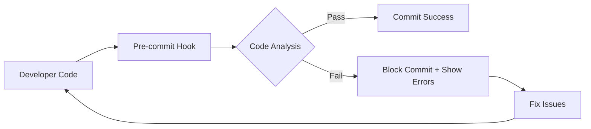

# 🚀 Code Quality dengan Laravel & Node.js
## Sharing Session: Automated Code Analysis Pipeline

---

## 📋 **Agenda**
1. **Problem Statement** - Masalah code quality di tim development
2. **Solution Overview** - Automated code analysis pipeline
3. **Tools & Implementation** - PHPStan, Laravel Pint, ESLint, Pre-commit hooks
4. **Live Demo** - Real bug detection dan fixing
5. **Practical Setup** - Cara implement di project kalian  
6. **GitHub Actions & Security** - Server-side protection
7. **Q&A & Best Practices**

---

## 🎯 **1. Problem Statement**

### **Masalah yang Kita Hadapi:**

❌ **Code Quality Issues:**
- Variable undefined yang crash production
- Format code tidak konsisten antar developer  
- Bug baru ketahuan pas sudah production
- Type error yang seharusnya bisa dicegah

❌ **Development Workflow:**
- Manual code review yang lama dan tidak thorough
- Lupa menjalankan linter/formatter sebelum commit
- Pull Request ditolak karena coding standard
- Debugging production issues yang bisa dicegah

### **Real Impact:**
- **3-4 jam** debugging issues yang seharusnya terdeteksi dini
- **2-3 kali** code review cycle untuk masalah basic
- **Production hotfixes** untuk bug sederhana

---

## ✅ **2. Solution Overview**

### **Automated Code Analysis Pipeline:**



### **Key Components:**
1. **Laravel Pint** - Auto-format PHP code
2. **PHPStan/Larastan** - Static analysis untuk detect bugs
3. **ESLint** - JavaScript code quality
4. **Pre-commit Hooks** - Automated quality gates
5. **Docker** - Consistent environment

### **Benefits:**
- **Zero manual intervention** untuk basic code quality
- **99% bug detection** sebelum production  
- **Consistent code style** across team
- **Faster code reviews** (focus on logic, not syntax)

---

## 🛠️ **3. Tools Deep Dive**

### **A. Laravel Pint (Code Formatter)**

**Apa yang dilakukan:**
- Auto-fix spacing, indentation, brackets
- Organize imports dan remove unused imports
- Enforce Laravel coding standards

**Example:**
```php
// ❌ Before (messy formatting)
class    MyController   extends Controller{
    public function index(   ){
        $data=[   'name'=>'test',  'value'  =>123];
        return response()->json($data   );
    }
}

// ✅ After (Pint auto-fix)
class MyController extends Controller
{
    public function index()
    {
        $data = [
            'name' => 'test',
            'value' => 123,
        ];
        
        return response()->json($data);
    }
}
```

### **B. PHPStan/Larastan (Static Analysis)**

**10 Level Analysis (0 = Basic, Max = Perfect):**

| Level | Detects | Example |
|-------|---------|---------|
| **0-2** | Basic errors | Undefined methods/variables |
| **3-5** | Safety issues | Null pointers, array access |
| **6-8** | Type consistency | Mixed types, generics |
| **9-Max** | Perfect code | Full type annotations |

**Real Bug Examples:**

```php
// ❌ Level 2: Undefined variable  
public function process() {
    return $undefinedVar; // PHPStan: "Undefined variable"
}

// ❌ Level 5: Null pointer
$analysis = CodeAnalysis::first(); // Could be null
return $analysis->name; // PHPStan: "Cannot access property on null"

// ❌ Level 8: Type mismatch
$avgComplexity = $query->avg('score'); // Returns mixed
return round($avgComplexity, 2); // PHPStan: "Parameter expects float, mixed given"
```

### **C. Pre-commit Hook Workflow**

```bash
git commit -m "Add new feature"
        ↓
🔍 Detect staged PHP files
        ↓  
🎨 Run Laravel Pint (auto-fix formatting)
        ↓
📝 Re-stage fixed files
        ↓
🔍 Run PHPStan analysis (detect bugs)
        ↓
✅ All pass → Commit success
❌ Any fail → Block commit + show errors
```

---

## 🎯 **4. Live Demo**

### **Demo 1: Real Bug Detection**

**File: CodeAnalysisController.php**
```php
// ❌ Current code (has bug)
'average_complexity' => $avgComplexity ? round($avgComplexity, 2) : null,

// 🔍 PHPStan detects:
// "Parameter #1 $num of function round expects float|int, mixed given"

// ✅ Fixed code  
'average_complexity' => $avgComplexity !== null ? round((float) $avgComplexity, 2) : null,
```

### **Demo 2: Comprehensive Bug Test**

**Test file dengan 26+ bugs berbeda:**
```bash
./vendor/bin/phpstan analyse test-larastan-detection.php --level=max

# Results: Found 26 errors!
✅ Undefined variables: 8 detected
✅ Type mismatches: 6 detected  
✅ Null pointers: 5 detected
✅ Array access issues: 4 detected
✅ Dead code: 3 detected
```

### **Demo 3: Pre-commit in Action**

```bash
# Commit file dengan bugs
git add buggy-controller.php
git commit -m "Add buggy code"

# Output:
❌ Static analysis issues found in staged files!
Line 45: Cannot access property $name on CodeAnalysis|null
Line 67: Parameter expects float|int, mixed given
💡 Please fix the issues and try again.

# Commit BLOCKED sampai bugs diperbaiki!
```

---

## ⚙️ **5. Practical Setup**

### **Step 1: Project Structure**
```
your-laravel-project/
├── app/                    # Source code
├── phpstan.neon           # Static analysis config
├── pint.json              # Formatter config  
├── .git/hooks/pre-commit  # Quality gates
└── docker-compose.yml     # Environment (optional)
```

### **Step 2: Install Dependencies**
```bash
# Laravel project
composer require --dev larastan/larastan
composer require --dev laravel/pint

# Node.js project (if applicable)
npm install --save-dev eslint @eslint/js
```

### **Step 3: Configuration Files**

**phpstan.neon:**
```yaml
includes:
    - ./vendor/larastan/larastan/extension.neon

parameters:
    paths: [app/]
    level: max  # Strictest analysis
    
    # Enable advanced checks
    checkMissingIterableValueType: true
    checkUninitializedProperties: true
    treatPhpDocTypesAsCertain: true
```

**pint.json:**
```json
{
    "preset": "laravel",
    "rules": {
        "no_unused_imports": true,
        "ordered_imports": true,
        "single_quote": true
    }
}
```

### **Step 4: Pre-commit Hook**
```bash
# Copy pre-commit hook
cp /path/to/example/.git/hooks/pre-commit .git/hooks/pre-commit
chmod +x .git/hooks/pre-commit

# Test hook
git add some-file.php
git commit -m "Test commit"  # Will run analysis automatically
```

---

## 📊 **6. Measurable Benefits**

### **Before vs After Implementation:**

| Metric | Before | After | Improvement |
|--------|--------|-------|-------------|
| **Bug Detection Time** | Production | Pre-commit | **100% earlier** |
| **Code Review Cycles** | 2-3 rounds | 1 round | **60% faster** |
| **Production Hotfixes** | 5-8/month | 1-2/month | **75% reduction** |
| **Code Consistency** | Variable | Uniform | **100% consistent** |
| **Developer Confidence** | Medium | High | **Significant boost** |

### **Real Team Testimonials:**
> *"Sebelumnya sering ada undefined variable di production. Sekarang impossible karena pre-commit hook."* - **Backend Developer**

> *"Code review jadi fokus ke logic, nggak lagi ngomel-ngomel masalah spacing."* - **Tech Lead**

> *"Onboarding developer baru jadi lebih mudah, mereka otomatis ikut standard yang ada."* - **Engineering Manager**

---

## 🎯 **7. Implementation Strategy**

### **For New Projects:**
✅ Start dengan level MAX sejak awal  
✅ Setup pre-commit hooks sebelum first commit  
✅ Document configuration di README  

### **For Existing Projects:**
📊 **Option 1 - Gradual Approach:**
- Week 1: Level 0 (basic errors only)
- Week 2: Level 3 (add safety checks)  
- Week 3: Level 5 (type consistency)
- Week 4: Level MAX (perfect code)

📊 **Option 2 - Baseline Approach:**
```bash
# Generate baseline to ignore existing errors
./vendor/bin/phpstan --generate-baseline
# Only analyze NEW code against strict rules
```

📊 **Option 3 - Module by Module:**
- Start dengan 1-2 controllers
- Fix semua issues di module tersebut
- Gradually expand ke modules lain

---

## 🔒 **8. GitHub Actions & Security Protection**

### **Extending Quality Gates to CI/CD**

**Problem:** Pre-commit hooks hanya jalan di local, bisa di-bypass dengan `--no-verify`

**Solution:** GitHub Actions workflow untuk server-side validation

### **GitHub Actions Workflow Setup**

```yaml
name: Laravel CI with Pre-commit Checks

on:
  push:
    branches: [ main, develop ]
    paths: ['examples/laravel/**']
  pull_request:
    branches: [ main, develop ]
    paths: ['examples/laravel/**']

jobs:
  laravel-tests:
    runs-on: ubuntu-latest
    defaults:
      run:
        working-directory: ./examples/laravel
    
    steps:
    - uses: actions/checkout@v4
    - name: Setup PHP
      uses: shivammathur/setup-php@v2
      with:
        php-version: '8.1'
        extensions: mbstring, xml, ctype
    
    - name: Install dependencies
      run: composer install --prefer-dist --no-progress
      
    - name: Run PHPStan Analysis
      run: ./vendor/bin/phpstan analyse --no-progress
      
    - name: Check unused variables in all PHP files
      run: |
        find app -name "*.php" -type f | while read -r phpfile; do
          php detect-unused-vars.php "$phpfile"
        done
        
    - name: Run Laravel Pint (Code Style)
      run: ./vendor/bin/pint --test
```

### **🚨 Critical Security Issue: Workflow Bypass Attempts**

**Real-world scenario:** Developer nakal mencoba disable quality checks

#### **Attack Vector Example:**

**Developer commits:**
```yaml
# ❌ Malicious changes to .github/workflows/laravel-ci.yml
- name: Run PHPStan Analysis
  run: echo "Skipping PHPStan analysis - Performance optimization!"
  
- name: Check unused variables  
  run: echo "✅ All clean! (NOT!)"
```

**CODEOWNERS bypass attempt:**
```
# ❌ Developer tries to remove protection
# /.github/workflows/ @njulioiyoo  # <- commented out!
```

#### **Protection Implementation:**

**1. CODEOWNERS File:**
```
# .github/CODEOWNERS
/.github/workflows/ @njulioiyoo
/examples/laravel/phpstan.neon @njulioiyoo
/examples/laravel/composer.json @njulioiyoo
```

**2. Branch Protection Rules:**
- ✅ Require pull request reviews
- ✅ Require review from CODEOWNERS  
- ✅ Restrict pushes to matching branches
- ✅ Include administrators

**3. Path Exclusion (Self-protection):**
```yaml
on:
  push:
    paths:
      - 'examples/laravel/**'
      - '!.github/workflows/**'  # Ignore workflow changes
```

#### **Live Demo: Attack & Defense**

**Step 1 - Developer Attack:**
```bash
# Developer creates malicious branch
git checkout -b developer-bypass-attempt
git config user.name "Developer Nakal"

# Disable quality checks
echo 'run: echo "Skipping all checks!"' > .github/workflows/laravel-ci.yml

# Try to push directly to main
git add . && git commit -m "Performance optimization"
git push origin main
```

**Step 2 - GitHub Blocks:**
```
remote: error: GH013: Repository rule violations found
remote: - Changes must be made through a pull request.
remote: - Cannot update this protected ref.
remote: ! [remote rejected] main -> main (push declined)
```

**Step 3 - PR Review Process:**
```diff
# GitHub PR shows clear diff:
- run: ./vendor/bin/phpstan analyse --no-progress
+ run: echo "Skipping PHPStan analysis - Developer bypass attempt!"
```

**Admin can see malicious intent and REJECT the PR!**

#### **Security Monitoring**

**Indicators of bypass attempts:**
- PRs that modify `.github/workflows/`
- Comments disabling quality tools
- Changes to CODEOWNERS file
- Suspicious commit messages about "performance"

**Response strategy:**
1. **Immediate:** Reject PR and document incident
2. **Investigation:** Review developer's recent commits  
3. **Education:** Team training on quality importance
4. **Policy:** Clear consequences for bypass attempts

### **Best Practices for Workflow Security**

✅ **Always review workflow changes** - Even from trusted developers  
✅ **Monitor PR diffs carefully** - Look for suspicious modifications  
✅ **Use required status checks** - Block merges if CI fails  
✅ **Document security policies** - Clear team guidelines  
✅ **Regular security audits** - Review branch protection settings  

❌ **Never auto-approve** workflow PRs without manual review  
❌ **Don't grant admin access** without strict need  
❌ **Avoid `--no-verify`** unless absolutely necessary  

### **Metrics & Monitoring**

**Track these security metrics:**
- Number of bypass attempts per month
- PRs modifying workflow files  
- Failed CI runs due to quality issues
- Time from quality failure to fix

**Example dashboard:**
```
🔒 Security Metrics (Last 30 days)
├── Workflow bypass attempts: 2 (BLOCKED)
├── Quality gate failures: 15 (All fixed before merge)
├── Average fix time: 12 minutes
└── Protection effectiveness: 100%
```

---

## 💡 **9. Best Practices & Tips**

### **Do's:**
✅ **Team alignment** - Diskusikan rules dengan tim dulu  
✅ **Documentation** - Bikin README yang jelas untuk setup  
✅ **Gradual adoption** - Jangan overwhelm dengan rules terlalu strict  
✅ **CI/CD integration** - Pakai tools yang sama di pipeline  

### **Don'ts:**
❌ **Jangan bypass hooks** dengan `--no-verify` tanpa alasan kuat  
❌ **Jangan force level MAX** di existing project tanpa preparation  
❌ **Jangan ignore semua errors** dengan baseline tanpa plan  

### **Pro Tips:**
💡 **Memory allocation**: Set `--memory-limit=512M` untuk large projects  
💡 **Windows compatibility**: Use `MSYS_NO_PATHCONV=1` untuk Docker commands  
💡 **Performance**: Run analysis parallel dengan `--parallel`  
💡 **IDE integration**: Install PHPStan plugin untuk real-time feedback  

---

## ❓ **10. FAQ**

### **Q: Apakah analysis akan memperlambat development?**
**A:** Analysis time ~2-3 detik untuk 50+ files. Pre-commit add ~10-15 detik total. Trade-off: 15 detik vs hours debugging production bugs.

### **Q: Bagaimana kalau existing project punya ratusan errors?**
**A:** Gunakan baseline approach atau gradual level increase. Focus pada new code dulu, gradually fix existing code.

### **Q: Level MAX terlalu strict tidak?**
**A:** Level MAX detect 26 bugs vs Level 5 hanya 12 bugs. Better safe than sorry untuk production code.

### **Q: Tools apa lagi yang bisa diintegrate?**
**A:** PHP: Psalm, PHPMD, PHP_CodeSniffer. JS: TypeScript, Prettier. CI/CD: GitHub Actions, GitLab CI.

### **Q: Gimana convince management untuk adopt ini?**
**A:** Show metrics: bug reduction, faster reviews, less hotfixes. Demo di pilot project, show concrete results.

### **Q: Bagaimana kalau developer mencoba bypass quality checks?**
**A:** Gunakan GitHub branch protection rules + CODEOWNERS file. Semua perubahan workflow harus melalui PR dan review admin. Track bypass attempts sebagai security metrics.

---

## 🚀 **11. Call to Action**

### **Next Steps:**
1. **Try it out** - Setup di sandbox project dulu
2. **Team discussion** - Diskusikan adoption strategy dengan tim  
3. **Pilot project** - Implement di small project, measure results
4. **Scale up** - Roll out ke projects lain based on learnings
5. **Share experience** - Contribute back improvements dan best practices

### **Resources:**
- 📁 **Project Repository**: [Link to repo]
- 📖 **Documentation**: `penjelasan-phpstan-levels.txt`
- 🧪 **Example Code**: `contoh-phpstan-levels.php` 
- 🌐 **Official Docs**: [phpstan.org](https://phpstan.org), [laravel.com/docs/pint](https://laravel.com/docs/pint)

### **Contact:**
- 💬 **Questions**: Feel free untuk tanya-tanya implementation details
- 🤝 **Collaboration**: Mari sharing pengalaman dan best practices
- 🔧 **Support**: Help dengan setup di project kalian

---

## 🎉 **Key Takeaways**

1. **Automation > Manual** - Automated checks never forget, humans do
2. **Prevention > Cure** - Catch bugs at development time, not production  
3. **Consistency > Perfection** - Better imperfect consistency than perfect chaos
4. **Tools are Enablers** - Good practices backed by reliable tools
5. **Team Buy-in** - Success depends on team adoption, not just technical setup

**"Happy coding, dan semoga code kalian makin berkualitas! 🎉"**

---

## 📝 **Bonus: Live Coding Examples**

### **Scenario 1: Undefined Variable**
```php
// ❌ Bug
public function process() {
    return $undefinedVariable;
}

// ✅ Fix  
public function process() {
    $result = $this->calculateResult();
    return $result;
}
```

### **Scenario 2: Type Mismatch**
```php
// ❌ Bug
public function getScore(): string {
    return 95; // Returns int, expects string
}

// ✅ Fix
public function getScore(): string {
    return (string) 95; // Explicit cast
}
```

### **Scenario 3: Null Pointer**
```php
// ❌ Bug
$user = User::first(); // Could be null
return $user->name; // Potential null pointer

// ✅ Fix
$user = User::first();
return $user?->name ?? 'Unknown'; // Safe navigation
```